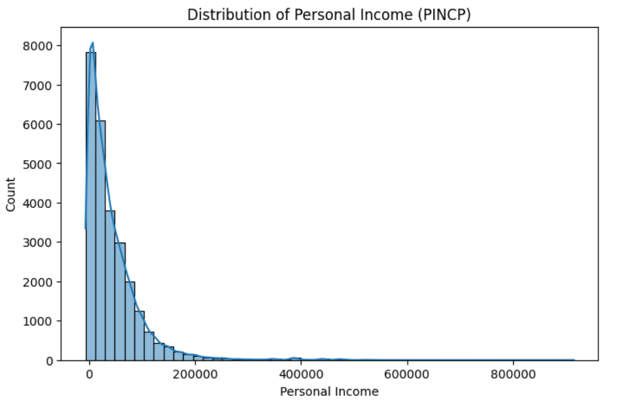
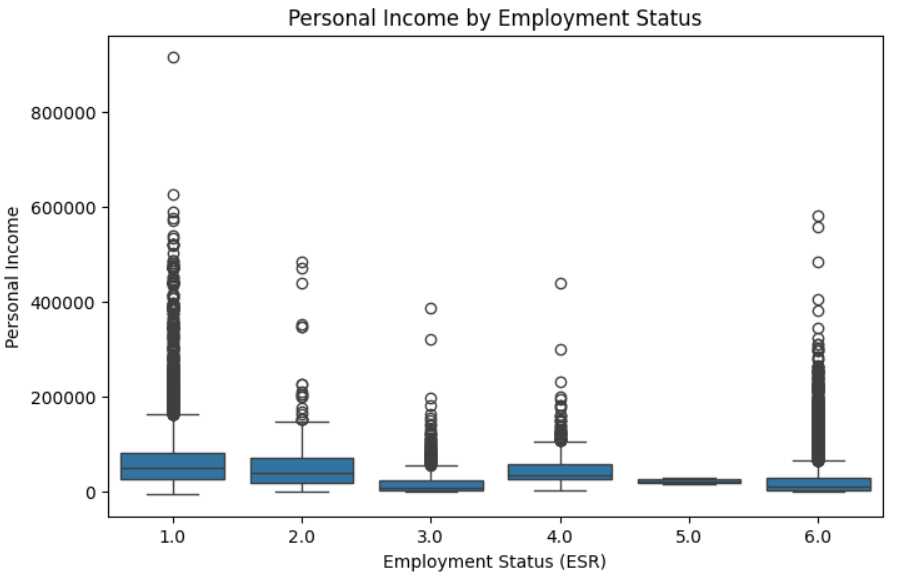

# U.S. Census Income Prediction

## Project Overview

This project uses person-level American Community Survey Public Use Microdata Sample (ACS PUMS) data from the U.S. Census Bureau to examine whether demographic and employment-related characteristics can be used to predict personal income.

The project includes data preparation, exploratory data analysis, visualization, predictive modeling, and evaluation of three regression models: Linear Regression, Random Forest Regression, and Gradient Boosting Regression.

## Project Links

* [View the Complete Jupyter Notebook](us_census_income_prediction.ipynb)
* [View the Final Project Report](us_census_income_prediction_report.pdf)

## Research Question

Can an individual's total personal income be predicted using demographic and employment-related characteristics?

## Dataset

The analysis uses person-level ACS PUMS data from the U.S. Census Bureau. The source dataset contains approximately 33,000 observations and 290 variables.

A subset of variables was selected for the analysis:

* `PINCP`: Total personal income
* `AGEP`: Age
* `SEX`: Sex
* `MAR`: Marital status
* `ENG`: English proficiency
* `LANX`: Language spoken at home
* `COW`: Class of worker
* `ESR`: Employment status
* `WKHP`: Weekly hours worked
* `JWMNP`: Commute time

Dataset source: [U.S. Census Bureau ACS PUMS](https://www.census.gov/programs-surveys/acs/microdata.html)

The raw dataset is not included in this repository. To run the notebook, download the appropriate person-level PUMS CSV file from the U.S. Census Bureau and save it as `psam_p02.csv` in the project directory.

## Tools and Technologies

* Python
* Jupyter Notebook
* Pandas
* NumPy
* Matplotlib
* Seaborn
* Scikit-learn

## Project Workflow

1. Loaded and inspected the ACS PUMS dataset.
2. Selected demographic and employment-related variables.
3. Cleaned the data and handled missing values.
4. Performed exploratory data analysis.
5. Created six visualizations to examine income patterns.
6. Split the prepared data into training and testing sets.
7. Developed three regression models.
8. Evaluated the models using MAE, RMSE, and R².
9. Compared the performance of the models.

## Exploratory Data Analysis

Six visualizations were developed to examine the distribution of personal income and its relationships with demographic and employment-related characteristics.

### 1. Distribution of Personal Income



Personal income is strongly right-skewed. Most observations are concentrated at lower and moderate income levels, while a smaller number of individuals have substantially higher incomes.

### 2. Personal Income vs. Age

The analysis shows a general positive relationship between age and personal income. However, the wide variation within age groups indicates that age alone does not fully explain differences in income.

### 3. Personal Income vs. Weekly Hours Worked

Individuals working more hours per week generally have higher incomes. However, the substantial variation indicates that working hours alone do not fully explain income differences.

### 4. Correlation Analysis

The correlation heatmap shows positive associations between personal income and age, as well as between personal income and weekly hours worked. The moderate correlations suggest that income is influenced by several interacting factors.

### 5. Personal Income by Employment Status



Income distributions vary across employment-status categories, indicating that employment status provides useful information for predicting personal income.

### 6. Personal Income by Marital Status

Income distributions differ across marital-status categories, suggesting that marital status may be associated with income through differences in household structure and employment patterns.

The complete visualizations and detailed interpretations are available in the [Jupyter Notebook](us_census_income_prediction.ipynb) and [Final Project Report](us_census_income_prediction_report.pdf).

## Predictive Models

Three regression models were developed and evaluated:

* Linear Regression
* Random Forest Regression
* Gradient Boosting Regression

The dataset was divided into training and testing sets using an 80/20 split with a fixed random state for reproducibility.

Model performance was evaluated using:

* Mean Absolute Error (MAE)
* Root Mean Squared Error (RMSE)
* R² score

## Model Results

| Model                        | MAE (USD) | RMSE (USD) |    R² |
| ---------------------------- | --------: | ---------: | ----: |
| Linear Regression            | 27,077.50 |  47,346.38 | 0.279 |
| Random Forest Regression     | 25,314.33 |  47,054.87 | 0.288 |
| Gradient Boosting Regression | 24,116.14 |  45,172.67 | 0.344 |

Gradient Boosting demonstrated the strongest overall performance, producing the lowest MAE and RMSE and the highest R². Random Forest provided a modest improvement over Linear Regression.

## Key Findings

* Personal income has a strongly right-skewed distribution.
* Age and weekly hours worked show positive relationships with personal income.
* Income distributions vary across employment-status and marital-status categories.
* Random Forest performed slightly better than Linear Regression.
* Gradient Boosting achieved the best overall predictive performance.
* Personal income may also depend on factors not selected for this analysis, such as education, occupation, industry, geographic location, and work experience.

## Repository Contents

* `us_census_income_prediction.ipynb`: Complete analysis, code, visualizations, and model outputs
* `data_utils.py`: Reusable functions for loading, cleaning, and preparing the data
* `us_census_income_prediction_report.pdf`: Detailed project report and findings
* `requirements.txt`: Python libraries required to run the project
* `images/`: Selected project visualizations
* `.gitignore`: Files excluded from version control

## My Contribution

I completed the end-to-end technical implementation of this project, including data preparation, exploratory data analysis, visualizations, development and evaluation of three regression models, model comparison, and documentation of the findings.

## How to Run the Project

1. Download the appropriate person-level ACS PUMS CSV file from the [U.S. Census Bureau](https://www.census.gov/programs-surveys/acs/microdata.html).

2. Save the dataset as `psam_p02.csv` in the project directory.

3. Install the required Python libraries:

   ```bash
   pip install -r requirements.txt
   ```

4. Open `us_census_income_prediction.ipynb` in Jupyter Notebook.

5. Run the notebook cells in order.

## Note

The raw ACS PUMS dataset is not included in this repository because it is publicly available from the U.S. Census Bureau and is excluded through the `.gitignore` file.


